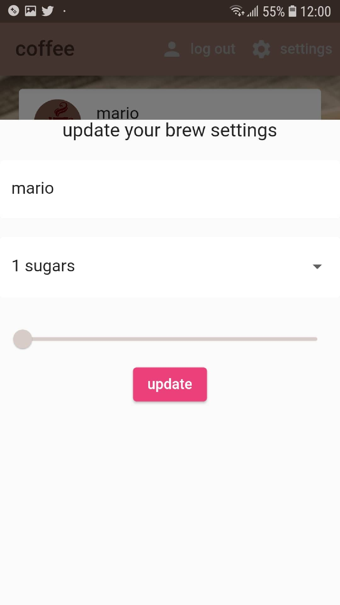

# flutter-coffee-app

👨‍🎤 Build a complete Flutter app with Firebase

🐦 Master most common Flutter widgets

🔏 User Authentication (Google, Anonymous)

⚒️ State Management with Provider

🔥 Model relational Firestore data

🤖 Firestore -> Dart Classes with JSON Serializable

## 📸 ScreenShots

|   |   |   |

## 🔌 Plugins

| Name                                                             | Usage                                                                                |
| -----------------------------------------------------------------| -------------------------------------------------------------------------------------|
| [**Provider**](https://pub.dev/packages/provider)                | State Management                                                                     |
| [**firebase_auth**](https://pub.dev/packages/firebase_auth)      | A Flutter plugin to use the Firebase Authentication API.                             |
| [**cloud_firestore**](https://pub.dev/packages/cloud_firestore)  | A Flutter plugin to use the Cloud Firestore API.                                     |
| [**firebase_core**](https://pub.dev/packages/firebase_core)      | A Flutter plugin to use the Firebase Core API                                        |
| [**flutter_spinkit**](https://pub.dev/packages/flutter_spinkit)  | A collection of loading indicators animated with flutter                             |
| [**get_it**](https://pub.dev/packages/get_it)                    | a simple Service Locator for Dart and Flutter projects with some additional goodies  |
| [**flutter_spinkit**](https://pub.dev/packages/flutter_spinkit)  | A collection of loading indicators animated with flutter                             |

